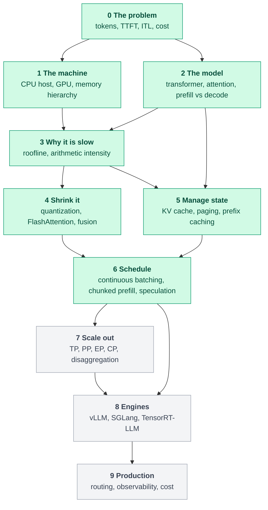

# Inference Engineering

**How large language models actually run on real hardware, built up from first principles.**

Most material on LLM inference is a list of techniques. This is a curriculum organised around one question: *which resource is the bottleneck, why, and which technique attacks it?* Every idea is derived, tied to the GPU it runs on, and backed by code you can run on a laptop.

> What happens between the moment you send a prompt and the moment the model produces its next token?

**Read it online:** [akbarsheikh-debug.github.io/inference-engineering](https://akbarsheikh-debug.github.io/inference-engineering/)

**Read it online:** [akbarsheikh-debug.github.io/inference-engineering](https://akbarsheikh-debug.github.io/inference-engineering/)

## Start here

| | |
|---|---|
| [00. The roadmap](curriculum/00-roadmap.md) | The five-layer stack, the dependency graph, and reading paths |
| [01. What happens between a prompt and the next token](curriculum/01-request-lifecycle.md) | Tokens, prefill, decode, and where the engine fits |
| [02. Why decode is slow on a machine that can do a petaflop](curriculum/02-why-decode-is-slow.md) | Arithmetic intensity, the roofline, tokens-per-second ceilings |
| [03. Why the KV cache exists, and why it fills your GPU](curriculum/03-kv-cache.md) | Cache arithmetic, GQA and MLA, paging |
| [04. Quantization: spending fewer bytes per number](curriculum/04-quantization.md) | Number formats, symmetric vs asymmetric, granularity, the straight-through estimator |
| [05. Continuous batching: never let a finished request hold a seat](curriculum/05-continuous-batching.md) | Head-of-line blocking, iteration-level scheduling, chunked prefill, the two knobs |
| [06. The GPU memory hierarchy](curriculum/06-gpu-memory-hierarchy.md) | Registers to HBM, coalescing and 32-byte sectors, shared-memory tiling |
| [07. FlashAttention: exact attention without the n-by-n matrix](curriculum/07-flashattention.md) | Online softmax, why it is exact, what it saves and what it does not |
| [08. Speculative decoding: more tokens per read of the weights](curriculum/08-speculative-decoding.md) | Accept/reject rule, the two-line exactness proof, expected speedup |

<!-- diagram:start d00-roadmap-dag -->

<!-- diagram:end -->

Green means at least one article is published; grey is planned. All diagrams are in the [diagram gallery](diagrams/README.md).

## Run the labs

Everything under `labs/cpu/` needs only Python and NumPy. No GPU.

```bash
git clone https://github.com/AkbarSheikh-debug/inference-engineering.git
cd inference-engineering
pip install -e ".[dev]"

python labs/cpu/00_tiny_decoder.py      # generate with and without a KV cache
python labs/cpu/01_roofline.py          # tokens-per-second ceilings for a model on a GPU
python labs/cpu/02_kv_calculator.py     # KV bytes per token, sequences that fit, MHA vs GQA vs MQA
python labs/cpu/03_paged_allocator.py   # contiguous slabs vs paged blocks
python labs/cpu/04_quantization.py      # symmetric vs asymmetric, per-tensor vs per-channel vs group
python labs/cpu/05_continuous_batching.py  # static vs continuous batching, token budgets
python labs/cpu/06_gpu_memory.py        # coalescing efficiency, tiled matrix-multiply traffic
python labs/cpu/07_flash_attention.py   # tiled attention is exact; traffic model
python labs/cpu/08_speculative_decoding.py  # accept/reject rule, exactness, expected speedup
pytest                                  # every number quoted in the articles is checked here
```

## What makes the numbers trustworthy

- **Every number is generated by code in [`src/ie/`](src/ie) or cited to a primary source** ([papers.md](papers.md)). A test fails if an article quotes a figure the code does not produce.
- **There are no measured benchmarks yet.** Everything quoted is arithmetic from published specifications and is labelled a ceiling, not a forecast. Measurements will live in `labs/bench/` with the hardware, driver and library versions recorded.
- **Units are stated once and kept.** Vendor capacity is binary (an "80 GB" GPU carries 80 GiB of HBM); bandwidth and FLOP/s are decimal. See [`src/ie/units.py`](src/ie/units.py).

## Repository layout

```
curriculum/   the articles
diagrams/     Mermaid sources in src/, generated SVGs in export/, gallery in README.md
labs/cpu/     runnable labs, one per idea
src/ie/       the arithmetic: hardware, models, KV cache, roofline, quantization, batching, paging, GPU memory, attention, speculation
blog/         a long-form post (Markdown and Substack-ready HTML) with 30 figures
tests/        unit tests, plus checks that articles match the code
tools/        diagram sync, figure generators, documentation checks
papers.md     primary sources and the claims they support
GLOSSARY.md   one definition per term, used consistently
```

## Contributing

Corrections are the most valuable contribution: a wrong number, an unsupported claim, an unclear derivation. See [CONTRIBUTING.md](CONTRIBUTING.md).

## License and attribution

Released under the [MIT License](LICENSE). Copyright (c) 2026 Akbar Arif.

You may use, copy, modify, fork and redistribute everything here, including commercially. The one condition is that the copyright and license notice (the [LICENSE](LICENSE) file) stays with every copy or substantial portion. If this material helps your work, please cite it (GitHub's "Cite this repository" button reads [CITATION.cff](CITATION.cff)) and link back to the source.
