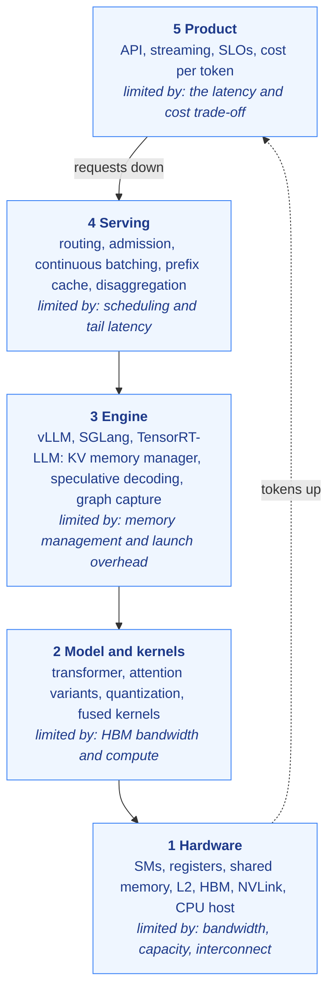
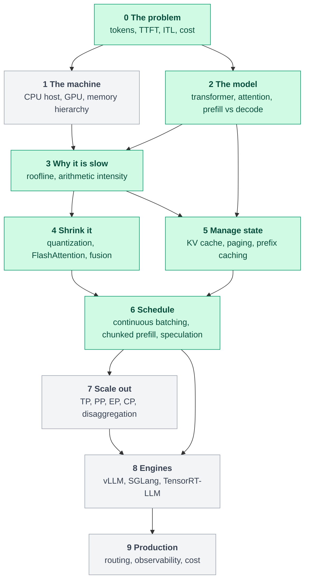

# 00. The roadmap: how to learn inference engineering

**Question this answers:** what do you actually need to know to understand how a large language model runs on real hardware, and in what order?

## The idea that organises everything

Most inference material is a list of techniques: quantization, batching, paged attention, speculative decoding. A list is hard to remember and easy to misapply. This curriculum is organised around one question that every technique answers:

1. **Which resource is the bottleneck?** Memory bandwidth, memory capacity, compute, launch overhead, idle GPU time, or the interconnect between GPUs.
2. **Why?** Show the arithmetic.
3. **Which technique attacks that bottleneck, and what does it cost?**

Once you can answer those three for a workload, the techniques stop being a list and become consequences. A batch-1 decode step is limited by memory bandwidth, so anything that moves fewer bytes or uses each byte more times helps. That single sentence already explains quantization, batching and speculative decoding.

## The stack you are learning

Everything in inference engineering lives in one of five layers. Knowing which layer a problem belongs to tells you who can fix it and what tools apply.

<!-- diagram:start d02-layered-stack -->

<!-- diagram:end -->

## The dependency graph

Learning order is a graph, not a ladder. Quantization needs the GPU memory hierarchy and the roofline, but not attention. Paging needs the KV cache but not kernels. A green node has at least one published article (some topics inside it may still be planned); grey nodes are planned.

<!-- diagram:start d00-roadmap-dag -->

<!-- diagram:end -->

## The levels

| Level | Question | Topics | Status |
|---|---|---|---|
| 0 | What is the problem? | autoregression, tokens, TTFT, ITL, throughput, cost | [01](01-request-lifecycle.md) |
| 1 | What is the machine? | CPU host, GPU, SMs, warps, registers, shared memory, L2, HBM, CUDA execution model | planned |
| 2 | What is the model doing? | forward pass, attention family (MHA, MQA, GQA, MLA), prefill vs decode | [01](01-request-lifecycle.md), [03](03-kv-cache.md) |
| 3 | Why is it slow? | roofline, arithmetic intensity, memory-bound vs compute-bound | [02](02-why-decode-is-slow.md) |
| 4 | How do we shrink it? | FP16/BF16/FP8/INT8/INT4/FP4, weight, activation and KV quantization, FlashAttention, kernel fusion | [04](04-quantization.md) (number formats, integer quantization); FlashAttention and fusion planned |
| 5 | How do we manage state? | KV cache arithmetic, PagedAttention, prefix caching | [03](03-kv-cache.md) |
| 6 | How do we schedule? | continuous batching, chunked prefill, speculative decoding | [05](05-continuous-batching.md) (continuous batching, chunked prefill); speculative decoding planned |
| 7 | How do we scale out? | tensor, pipeline, expert and context parallelism, disaggregated prefill and decode | planned |
| 8 | What runs it? | vLLM, SGLang, TensorRT-LLM, choosing an engine | planned |
| 9 | How do we run it in production? | routing, cold starts, observability, cost per token, failure modes | planned |

## Pick a path

| You are | Read in this order |
|---|---|
| An application engineer who calls an inference API | 01, 02, 04, 05, then level 9 |
| A kernel or performance engineer | 02, 04, then level 1, then 03 |
| An infrastructure or platform engineer | 01, 03, 05, then levels 7, 8 and 9 |
| A student starting from the transformer | 01 to 05 in order, then follow the graph |

## How every article is built

Each article follows the same nine steps: the question, intuition with a diagram, a derivation, the hardware view, a runnable lab, a measured result (only when one exists), a common misconception, three check-yourself questions, and primary sources.

Two rules make the numbers trustworthy. **Every number is generated by code in `src/ie/` or cited to a primary source**, and a test fails if an article quotes a number the code does not produce. **There are no measured benchmarks yet**; everything quoted is arithmetic from published specifications, and every such result is labelled a ceiling, not a forecast.

## Get started

Read [01. What happens between a prompt and the next token](01-request-lifecycle.md).

---

Copyright (c) 2026 Akbar Arif. Released under the [MIT License](../LICENSE). You may reuse and adapt this article as long as the copyright and license notice stays with it.
