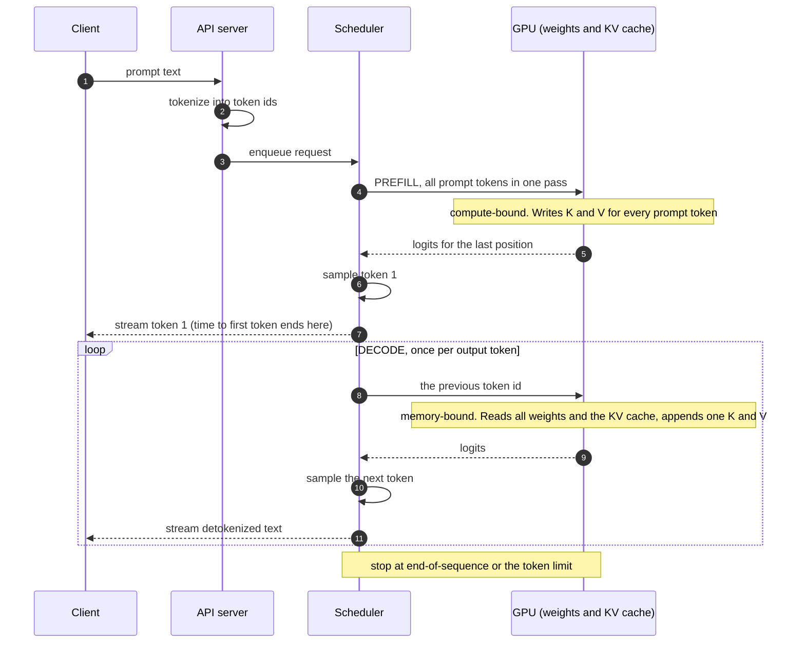
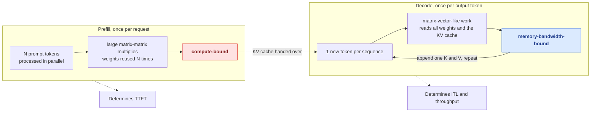
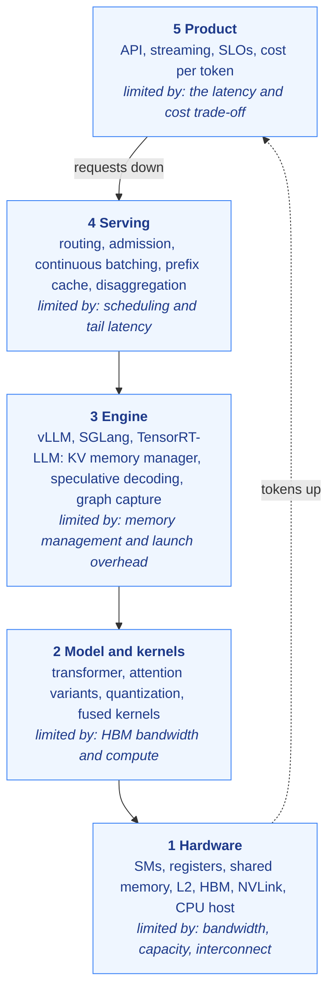

# 01. What happens between a prompt and the next token

**Question this answers:** when you send a prompt to a language model, what exactly runs, in what order, and where does the time go?

## The short answer

The model does not write a reply. It computes **one token**, appends it to the input, and runs again. A reply of 300 tokens is 300 trips through the same loop. Everything in inference engineering is about making that loop cheaper.

<!-- diagram:start d01-request-lifecycle -->

<!-- diagram:end -->

## The steps of one trip

**1. Tokenize.** The text becomes a list of integer ids using a fixed subword vocabulary. Llama 3 has a vocabulary of 128,256 tokens. The model never sees characters, only ids.

**2. Embed.** Each id selects a row of a learned table, producing one vector per token. This is a lookup, not a matrix multiply, so it touches a tiny part of the weights.

**3. Run the transformer blocks.** Each block does two things to every position. *Attention* lets a position read from earlier positions, and *the MLP* transforms each position on its own. Residual connections add each result back to its input, and a normalisation step (RMSNorm in Llama-style models) keeps the values stable. A model like Llama-3-8B stacks 32 of these blocks.

**4. Project to logits.** The last position's vector is multiplied by a large matrix that maps it to one score per vocabulary entry. These scores are the *logits*.

**5. Sample.** Turn logits into one token id. Greedy decoding takes the highest score; temperature, top-k and top-p sampling draw from the distribution instead. Sampling is cheap compared with everything before it.

**6. Append and repeat.** The chosen token joins the sequence, and the loop runs again until the model emits an end-of-sequence token or a length limit is hit.

## Two phases with opposite personalities

The very first trip is different from all the others. The prompt is already known, so the engine can push **all prompt tokens through the network at once**. That is **prefill**. After that, each new token depends on the previous one, so tokens must be produced one at a time. That is **decode**.

<!-- diagram:start d03-prefill-decode -->

<!-- diagram:end -->

This difference is the most important fact in the field. In prefill, one read of the weights serves many tokens, so the GPU spends its time computing. In decode, one read of the weights serves *one* token per sequence, so the GPU spends its time waiting for memory. [Article 02](02-why-decode-is-slow.md) quantifies this. The user-visible consequences are:

- **Time to first token (TTFT)** is dominated by prefill and grows with prompt length.
- **Inter-token latency (ITL)** is dominated by decode and depends mostly on how fast weights and cache can be read from memory.

## What one token costs

A transformer does about two floating-point operations per parameter for each token it processes (one multiply, one add), ignoring attention's dependence on context length. So an 8-billion-parameter model needs about 16 GFLOP per token. It also has to read its weights: at 2 bytes per parameter that is about 16 GB. Those two numbers, work and bytes, are the raw material of the next article.

## Where the inference engine fits

Between your prompt and the GPU sits a stack of software. Each layer solves a different problem, and knowing which layer owns a problem tells you what can fix it.

<!-- diagram:start d02-layered-stack -->

<!-- diagram:end -->

A serving engine such as vLLM, SGLang or TensorRT-LLM sits in the middle. It decides which requests run together, manages the memory that holds each request's state, and launches the GPU kernels that do the arithmetic.

## Lab: watch prefill and decode do different amounts of work

`labs/cpu/00_tiny_decoder.py` runs a small decoder-only transformer in NumPy. It is built from the real ingredients (RMSNorm, grouped-query attention, a gated MLP, residuals, an LM head) with random weights, so it produces meaningless text but honest arithmetic. It generates 32 tokens from a 32-token prompt twice, once recomputing everything each step and once with a KV cache.

```bash
python labs/cpu/00_tiny_decoder.py
```

Both runs produce identical tokens. The uncached run pushes 1,520 token positions through the network; the cached run pushes 63. Prefill handles 32 positions in one pass over the weights, and each decode step handles one. The cache is the subject of [article 03](03-kv-cache.md).

## Common misconceptions

- **"The model generates the whole answer at once."** It generates one token per pass. Streaming is not a UI trick; it is how generation works.
- **"A long prompt and a long answer cost the same."** They do not. A long prompt is processed in parallel (prefill), while each answer token needs its own pass (decode) and a growing cache to read.
- **"The GPU is busy the whole time, so it is being used well."** Busy and efficient are different. Article 02 shows a decode step can leave over 99 percent of a GPU's arithmetic capacity idle while still keeping its memory system fully occupied.

## Check yourself

1. A prompt has 2,000 tokens and the model produces 100. How many times does the model run in prefill mode and how many in decode mode?
2. Why can prefill process many tokens per pass over the weights while decode cannot?
3. Which of TTFT and ITL should get faster if you shorten the prompt, and why?

## Sources

- Vaswani et al., *Attention Is All You Need*, 2017. arXiv:1706.03762.
- Touvron et al., *Llama 2: Open Foundation and Fine-Tuned Chat Models*, 2023. arXiv:2307.09288.
- Llama Team, *The Llama 3 Herd of Models*, 2024. arXiv:2407.21783.

---

Copyright (c) 2026 Akbar Arif. Released under the [MIT License](../LICENSE). You may reuse and adapt this article as long as the copyright and license notice stays with it.
