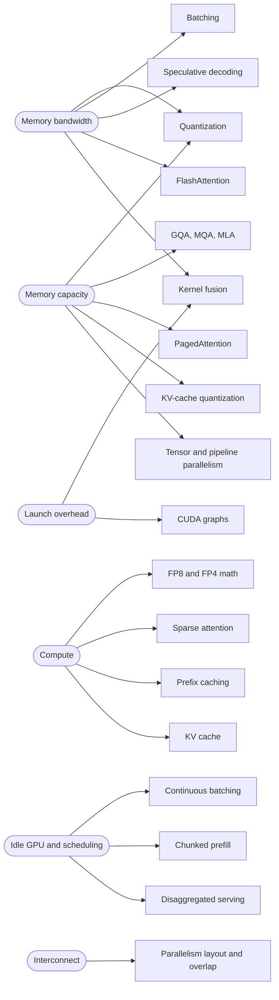

# 02. Why decode is slow on a machine that can do a petaflop

**Question this answers:** an H100 can perform roughly 989 trillion BF16 operations per second. Why does it take milliseconds to produce one token from an 8-billion-parameter model?

## What one decode step must do

To emit one token, the GPU must read **every weight** of the model once and perform about two operations with each. For Llama-3-8B in BF16:

- **Bytes:** 8.03 billion parameters x 2 bytes = 16.06 GB.
- **Work:** 2 x 8.03 billion = about 16 GFLOP.

The GPU can move data from its memory (HBM) at 3.35 TB/s and compute at 989 TFLOP/s. Moving 16.06 GB takes 4.79 ms. Computing 16 GFLOP takes about 0.016 ms. **The memory read is roughly 300 times longer than the arithmetic.** The arithmetic units sit idle waiting for weights to arrive.

## Arithmetic intensity

The ratio that captures this is **arithmetic intensity**: floating-point operations performed per byte moved from memory.

For a weight matrix used by `b` tokens at once, each weight costs `bytes_per_param` bytes to fetch and is used for 2 operations per token:

```
intensity = 2 x b / bytes_per_param        (FLOP per byte)
```

In BF16 (2 bytes per weight) that is simply **intensity = batch size**. One sequence decoding alone has intensity 1: one operation for every byte fetched.

## The roofline

A GPU has two ceilings: a compute ceiling (its peak FLOP/s) and a memory ceiling (bandwidth x intensity). Attainable performance is the lower of the two. Plotted on log axes this looks like a roof, and the intensity where the slope meets the flat part is the **ridge point**.


| GPU | Bandwidth | Peak BF16 (dense) | Ridge point |
|---|---|---|---|
| A100 80GB SXM | 2,039 GB/s | 312 TFLOP/s | 153 FLOP/byte |
| H100 80GB SXM | 3,350 GB/s | 989 TFLOP/s | 295 FLOP/byte |

Left of the ridge a workload is **memory-bound**: buying more compute changes nothing. Right of it, **compute-bound**: buying more bandwidth changes nothing. A batch-1 decode step sits at intensity 1, which on the H100 is **0.3 percent of peak** arithmetic throughput. Batch 16 reaches 5.4 percent and batch 64 reaches 21.7 percent. Only near a batch of about 295 do the weight matmuls become compute-bound.

## The ceiling on tokens per second

If a step is memory-bound, its time is the weight bytes divided by bandwidth. `labs/cpu/01_roofline.py` computes this for Llama-3-8B at batch 1:

| Weights | Size | H100 ms/token | H100 tokens/s | A100 ms/token | A100 tokens/s |
|---|---|---|---|---|---|
| BF16 | 16.06 GB | 4.79 | 209 | 7.88 | 127 |
| INT8 | 8.03 GB | 2.40 | 417 | 3.94 | 254 |
| INT4, group size 128 | 4.14 GB | 1.24 | 809 | 2.03 | 492 |

The INT4 row is 4.14 GB, not 4.02 GB, because group-wise quantization stores a 16-bit scale for every 128 weights, which adds 0.125 bits per weight (4.125 bits in total).

**These are ceilings, not predictions.** They use datasheet peaks, ignore attention arithmetic, kernel launch overhead and communication, and assume the memory system is perfectly used. Real engines land below them. This repository contains no measured benchmarks yet; when they arrive they will live in `labs/bench/` with the hardware and software versions recorded.

## Prefill is the opposite

Prefill pushes many tokens through each weight read. A 2,048-token prompt has an intensity of 2,048 in BF16, far right of the ridge, so it is compute-bound. Its ceiling is the arithmetic time: about 2 x 8.03 billion x 2,048 operations divided by 989 TFLOP/s, or **33.3 ms** on the H100, versus 4.79 ms for the weight read alone. Same GPU, same weights, opposite bottleneck. That is why engines treat the two phases differently and why [article 01](01-request-lifecycle.md) called them opposite personalities.

## Three ways to move a workload

Every decode optimisation attacks the same equation from one side.

1. **Raise intensity by batching.** Serve many sequences per weight read. Weights are read once for the whole batch, so intensity grows with batch size. The catch is that each sequence carries its own KV cache, and that cache is *not* shared across the batch. It becomes the next bottleneck, which is [article 03](03-kv-cache.md).
2. **Move fewer bytes.** Quantization shrinks each weight. It raises intensity at a fixed batch (INT8 doubles it) and lowers the batch needed to reach the ridge: 148 instead of 295 on the H100 for INT8.
3. **Get more tokens per weight read.** Speculative decoding proposes several tokens cheaply and verifies them in one pass, so one read of the weights can yield more than one accepted token.

Raising the roof, meaning a GPU with more FLOP/s and the same bandwidth, does nothing for a memory-bound step.

<!-- diagram:start d10-technique-bottleneck -->

<!-- diagram:end -->

## Common misconceptions

- **"GPU utilization of 100 percent means the GPU is saturated."** The utilization figure reported by `nvidia-smi` is the share of time in which at least one kernel was running. It says nothing about how much of the arithmetic capacity that kernel used. A memory-bound decode kernel can show 100 percent utilization at under 1 percent of peak FLOP/s.
- **"A faster GPU makes decode proportionally faster."** Only if it has proportionally more memory bandwidth. Compare the H100 and A100 rows above: the speed-up tracks the bandwidth ratio (3,350 / 2,039), not the compute ratio (989 / 312).
- **"Bigger batches are free."** They raise intensity, but each added sequence adds KV-cache reads and occupies cache memory.

## Check yourself

1. Why is intensity equal to batch size for BF16 weights? What would it be for INT4 weights at the same batch?
2. Llama-3-70B has about 70.6 billion parameters. What is the batch-1 ceiling in tokens per second on an H100 if the weights are in FP8 and fit on the card? (Compute it with the lab, then explain why BF16 does not fit on a single 80 GiB card.)
3. A colleague says "we bought GPUs with three times the FLOP/s, so decode should be three times faster." What single number would you ask for first?

## Reproduce

```bash
python labs/cpu/01_roofline.py --model llama-3-8b
python tools/roofline_svg.py        # regenerates the roofline figure
```

## Sources

- Williams, Waterman, Patterson, *Roofline: an insightful visual performance model for multicore architectures*, Communications of the ACM 52(4), 2009.
- Pope et al., *Efficiently Scaling Transformer Inference*, 2022. arXiv:2211.05102.
- NVIDIA A100 80GB and H100 datasheets, for bandwidth and dense BF16 throughput.
- Leviathan, Kalman, Matias, *Fast Inference from Transformers via Speculative Decoding*, 2023. arXiv:2211.17192.

---

Copyright (c) 2026 Akbar Arif. Released under the [MIT License](../LICENSE). You may reuse and adapt this article as long as the copyright and license notice stays with it.
