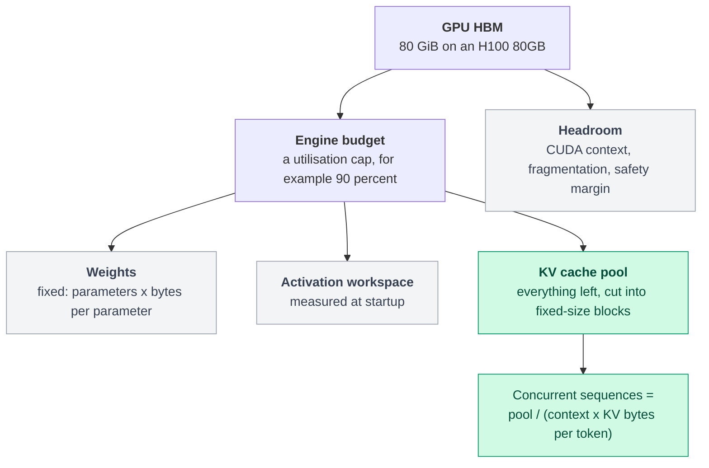
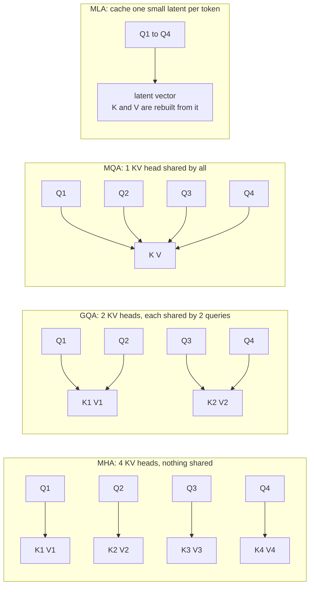
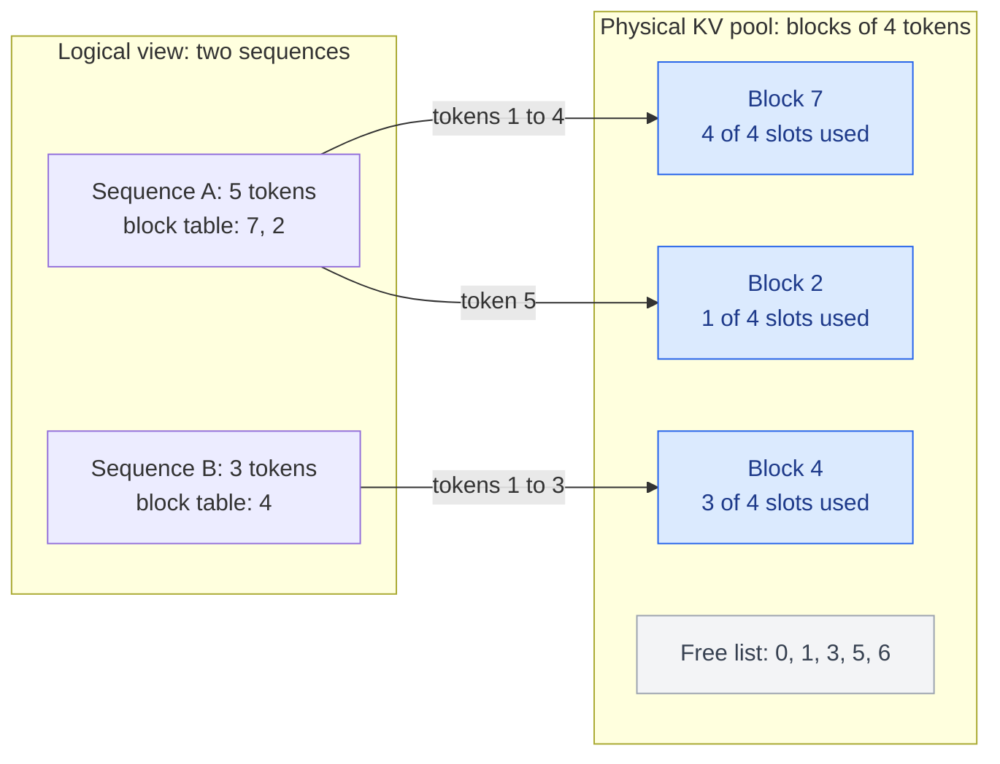

# 03. Why the KV cache exists, and why it fills your GPU

**Question this answers:** why does every serving engine keep a cache of keys and values, and why does that cache, not the weights, decide how many users a GPU can serve?

## The problem: recomputing the past

Attention lets each new token look at all earlier tokens. To do that, every token is projected into three vectors: a query (Q), a key (K) and a value (V). A token's output is a weighted sum of the *values* of earlier tokens, with weights computed from its *query* against their *keys*.

Now generate a reply naively. At every step, feed the whole sequence so far through the network and read off the last position. The first 1,000 tokens get their K and V recomputed again and again, even though nothing about them has changed. Because attention is causal (a token only sees earlier tokens), the K and V of an old token depend only on tokens before it, so they are identical every time.

**Fix: compute each token's K and V once, store them, and reuse them.** That store is the KV cache.

Why K and V but not Q? A past token's query was used to produce that token's own output, and that output is already done. Only the *new* token needs a query. Its query is compared against the *stored* keys and used to weight the *stored* values.

### How much work does this save?

For a prompt of `P` tokens and `N` generated tokens, the naive approach pushes `N x P + N(N-1)/2` token positions through the network. With a cache it pushes `P + N - 1`. `labs/cpu/00_tiny_decoder.py` runs both on a small NumPy transformer with `P = N = 32`:

| | No cache | KV cache |
|---|---|---|
| Positions processed | 1,520 | 63 |
| Matmul FLOPs | 81,440,768 | 3,223,552 |

That is 25.3 times fewer FLOPs, with **identical tokens** and a maximum logit difference of about 3e-15. The cache is exact, not an approximation.

## What it costs: bytes per token

For every token and every layer the cache stores one K and one V vector per KV head:

```
KV bytes per token = 2 x layers x KV heads x head_dim x bytes per element
```

| Model | KV heads | KiB per token | GiB at 8,192 tokens |
|---|---|---|---|
| Llama-2-7B (MHA) | 32 | 512 | 4.00 |
| Llama-3-8B (GQA) | 8 | 128 | 1.00 |
| Llama-3-70B (GQA) | 8 | 320 | 2.50 |

Llama-2-7B is evaluated at 8,192 tokens for comparison; it was trained for a 4,096-token context. One 8K conversation with Llama-3-8B holds exactly 1 GiB of cache. That is why the cache, not the weights, grows with your traffic.

## Where it lives: the memory budget

On a GPU, memory divides into weights (fixed), workspace, headroom, and a pool for the cache. Whatever is left after the fixed parts is the KV pool, and the pool divided by the per-sequence cache is your concurrency.

<!-- diagram:start d05-hbm-budget -->

<!-- diagram:end -->

Take an 80 GiB GPU, let the engine use 90 percent (72 GiB), and hold Llama-3-8B in BF16. Weights take 14.96 GiB (16.06 GB), leaving a **57.04 GiB pool**. At 8K context and 1 GiB per sequence, that is **57 concurrent sequences**. This ignores activation workspace, so it is an upper bound. Note the unit discipline: vendor capacity here is binary (80 GiB), while the weight size is decimal GB converted once.

## GQA: attack the multiplier

The formula has a factor you can change: the number of KV heads. Multi-head attention (MHA) gives every query head its own KV head. Multi-query attention (MQA, Shazeer 2019) shares one KV head across all query heads. Grouped-query attention (GQA, Ainslie et al. 2023) shares one KV head per *group* of query heads, a middle ground.

<!-- diagram:start d06-head-sharing -->

<!-- diagram:end -->

Llama-3-8B has 32 query heads and 8 KV heads, so each KV head serves 4 query heads. Counterfactuals from `labs/cpu/02_kv_calculator.py`, same model and GPU:

| Attention | KV heads | KiB per token | Sequences at 8K on 80 GiB |
|---|---|---|---|
| MHA | 32 | 512 | 14 |
| GQA (real Llama-3-8B) | 8 | 128 | 57 |
| MQA | 1 | 16 | 456 |

GQA cuts the cache 4x and lets four times as many users fit. MQA cuts it 32x but gives up more model quality. Ainslie et al. report that an existing MHA checkpoint can be converted to GQA with a small fraction of the original training compute (about 5 percent in the paper). **Multi-head latent attention (MLA)**, introduced in DeepSeek-V2, goes further: it caches one small latent vector per token and rebuilds keys and values from it. The paper reports a large reduction in cache size against its earlier dense model; read it for the exact comparison and the extra handling that positional encodings require.

## The bandwidth angle

Capacity is one problem; bandwidth is another. Every decode step reads the weights once *and* each sequence's entire cache. Weights are shared by the batch; caches are not. For Llama-3-8B, the cache read per step equals the weight read when `batch x context = 122,528` tokens. At batch 16 that happens at a context of about 7,658 tokens; at batch 64, about 1,915. Beyond that point the cache, not the weights, dominates each step, and the speed-ups from [article 02](02-why-decode-is-slow.md) start to erode. This is why KV-cache quantization and sparse attention exist.

## The fragmentation problem and paging

A sequence's final length is unknown when it starts, so a simple allocator reserves a contiguous slab for the maximum possible length. Most requests are far shorter, and the unused tail of every slab is wasted. Kwon et al. (the vLLM paper) profiled existing systems and found that only about 20 to 38 percent of the allocated cache memory held actual token states.

PagedAttention borrows the idea of virtual memory. Cut the pool into small fixed-size blocks, hand blocks to a sequence as it grows, and keep a per-sequence **block table** mapping logical token positions to physical blocks. Waste per sequence is bounded by one partly filled block.

<!-- diagram:start d07-paged-kv -->

<!-- diagram:end -->

`labs/cpu/03_paged_allocator.py` compares the two policies on the same pool with seeded synthetic requests (lognormal lengths, mean about 535 tokens, capped at 4,096):

| | Contiguous slabs | Paged blocks |
|---|---|---|
| Requests admitted | 64 | 479 |
| Pool slots holding tokens | 13.4% | 98.6% |

The distribution is synthetic and the contiguous policy reserves a 4,096-token maximum, so the *size* of the gap is an artefact of those choices. What it demonstrates is the mechanism: the gap grows with the ratio of the reserved maximum to the typical length. The toy also assumes lengths are known at admission; a real engine allocates blocks as decoding proceeds and must preempt a sequence if the pool runs dry.

## Common misconceptions

- **"The KV cache is a speed optimisation."** It is a trade of memory for compute. It makes each step cheap and makes memory capacity the binding constraint on concurrency.
- **"Caching changes the model's output."** It does not. The lab shows identical tokens and logits agreeing to floating-point precision.
- **"GQA is just a smaller model."** It reduces cache and bandwidth, but the weights barely change. The saving is in the state you carry per user.

## Check yourself

1. Why is the KV cache per token proportional to the number of *KV* heads, not query heads?
2. Llama-3-70B needs 320 KiB per token. How much cache does one 32K-token session need, and how does that compare with the 8B model at the same context?
3. If you double the weight precision from INT8 to BF16 on a fixed GPU, what happens to the number of concurrent sequences, and why?

## Reproduce

```bash
python labs/cpu/00_tiny_decoder.py
python labs/cpu/02_kv_calculator.py
python labs/cpu/03_paged_allocator.py
```

## Sources

- Vaswani et al., *Attention Is All You Need*, 2017. arXiv:1706.03762.
- Shazeer, *Fast Transformer Decoding: One Write-Head is All You Need*, 2019. arXiv:1911.02150.
- Ainslie et al., *GQA: Training Generalized Multi-Query Transformer Models from Multi-Head Checkpoints*, 2023. arXiv:2305.13245.
- DeepSeek-AI, *DeepSeek-V2: A Strong, Economical, and Efficient Mixture-of-Experts Language Model*, 2024. arXiv:2405.04434.
- Kwon et al., *Efficient Memory Management for Large Language Model Serving with PagedAttention*, 2023. arXiv:2309.06180.

---

Copyright (c) 2026 Akbar Arif. Released under the [MIT License](../LICENSE). You may reuse and adapt this article as long as the copyright and license notice stays with it.
