# Diagram gallery

Generated by `tools/sync_diagrams.py`; do not edit by hand. Edit the sources in
`src/` (Mermaid) and rerun the script. `D04` is drawn by `tools/roofline_svg.py`
from the hardware specs in `src/ie/hardware.py`.

## D00: Learning roadmap as a dependency graph

<!-- diagram:start d00-roadmap-dag -->
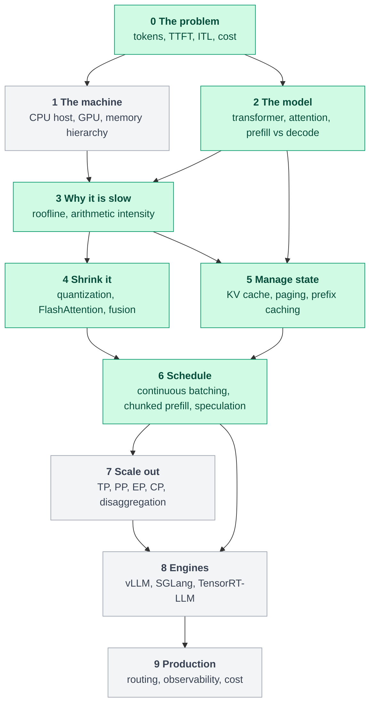
<!-- diagram:end -->

## D01: Request lifecycle from prompt to streamed tokens

<!-- diagram:start d01-request-lifecycle -->
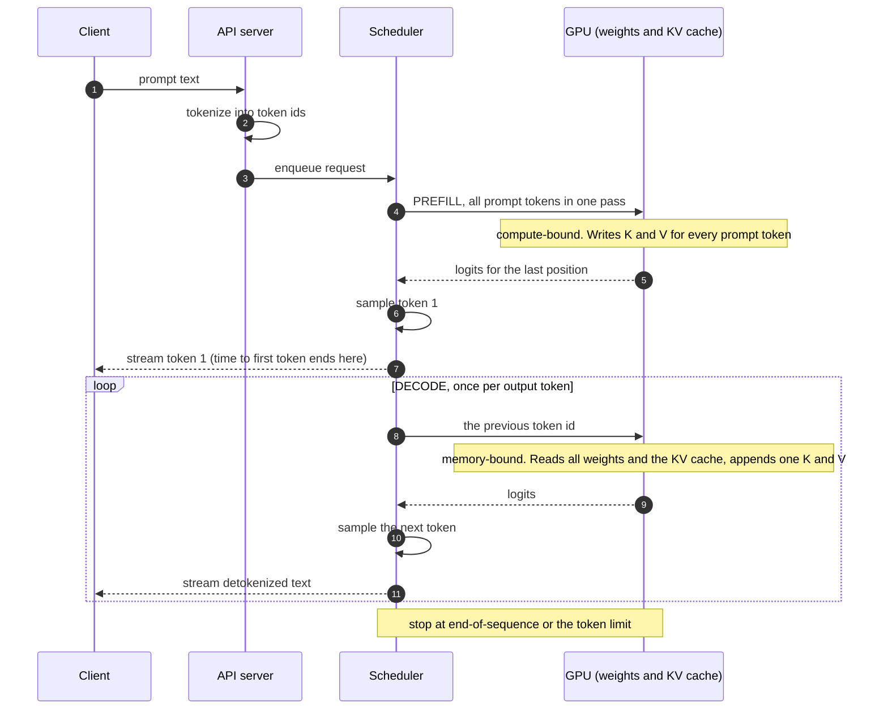
<!-- diagram:end -->

## D02: The five-layer inference stack

<!-- diagram:start d02-layered-stack -->
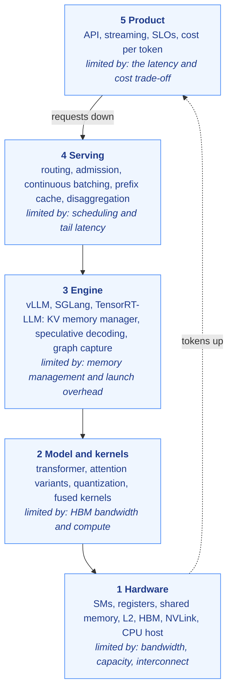
<!-- diagram:end -->

## D03: Prefill versus decode

<!-- diagram:start d03-prefill-decode -->
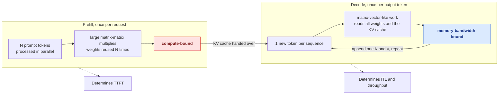
<!-- diagram:end -->

## D04: Roofline

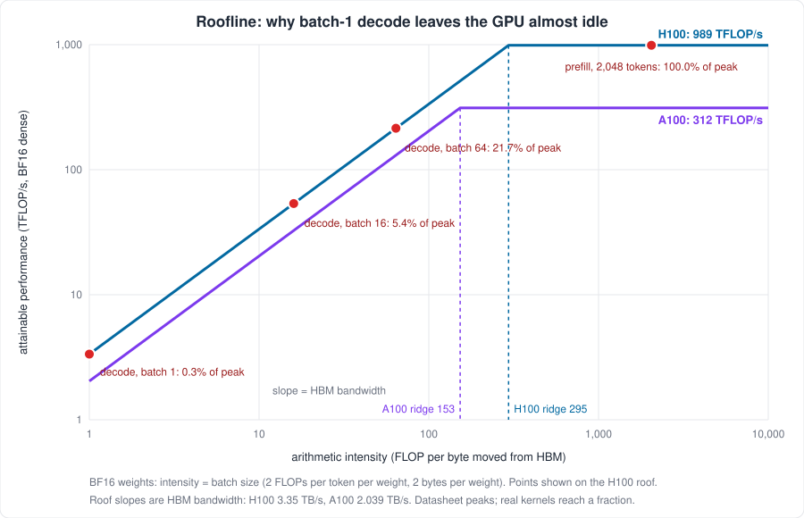

## D05: Where GPU memory goes

<!-- diagram:start d05-hbm-budget -->
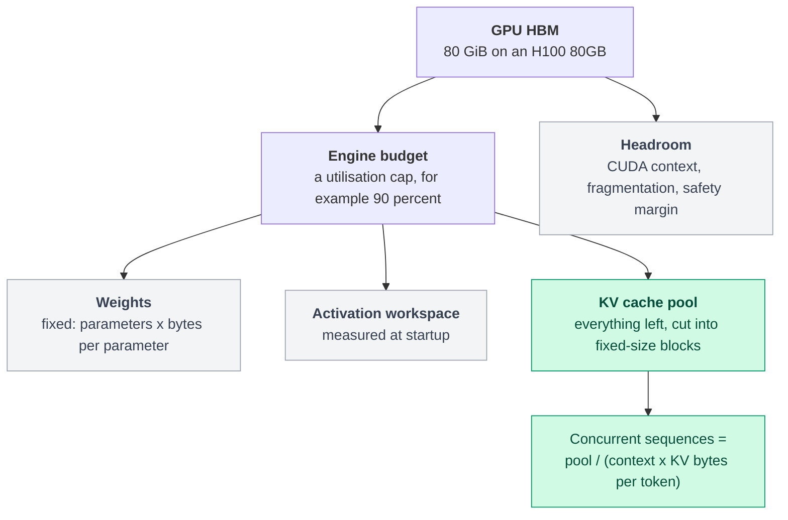
<!-- diagram:end -->

## D06: MHA, GQA, MQA and MLA: who shares which keys and values

<!-- diagram:start d06-head-sharing -->
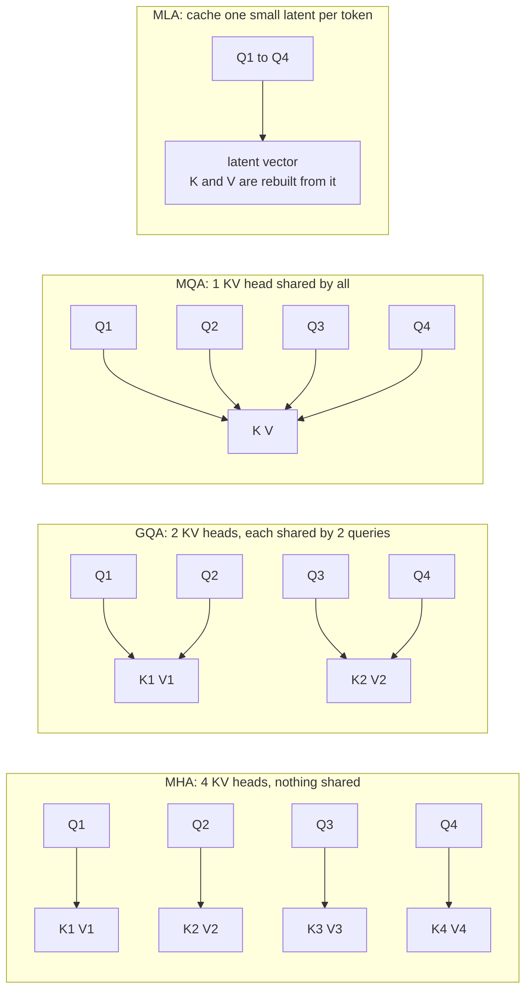
<!-- diagram:end -->

## D07: Paged KV cache and the block table

<!-- diagram:start d07-paged-kv -->
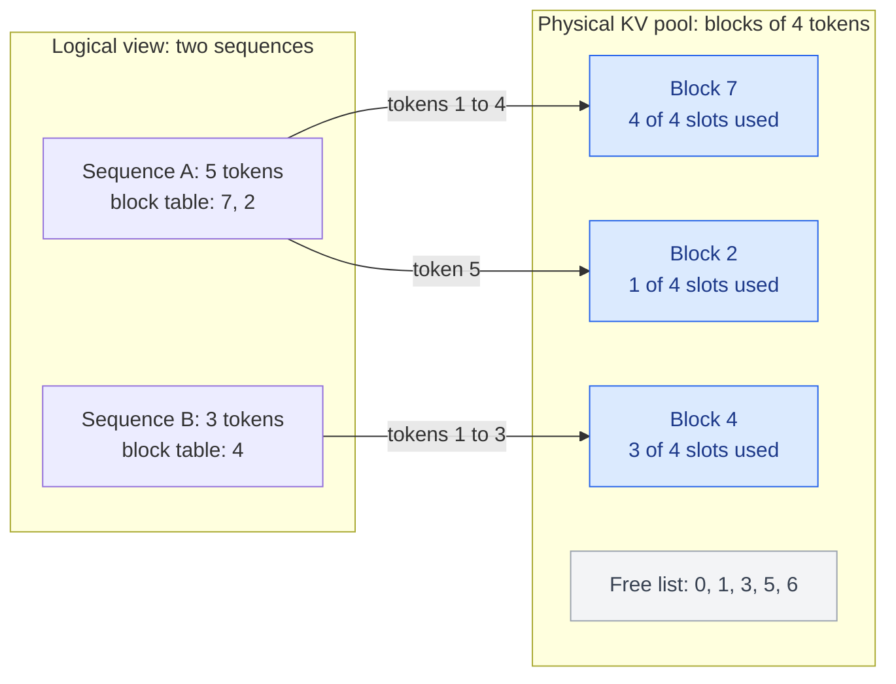
<!-- diagram:end -->

## D08: Continuous batching

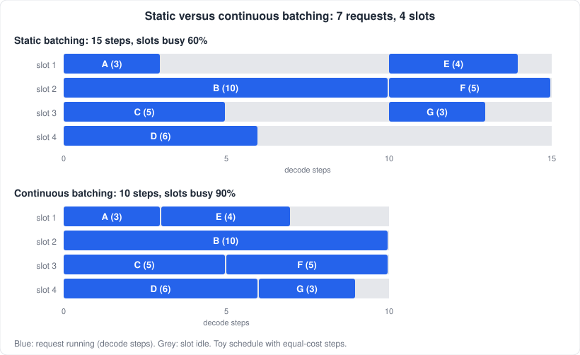

## D09: Four ways to split a model across GPUs

<!-- diagram:start d09-parallelism -->
```mermaid
%% title: Four ways to split a model across GPUs
flowchart TB
    subgraph TP["Tensor parallel: split each layer's matrices"]
        t1["GPU 0<br/>half of every weight matrix"] <-->|"all-reduce, every layer"| t2["GPU 1<br/>the other half"]
    end
    subgraph PP["Pipeline parallel: split the layers into stages"]
        p1["GPU 0<br/>first half of the layers"] -->|"activations"| p2["GPU 1<br/>second half of the layers"]
    end
    subgraph EP["Expert parallel: split the MoE experts"]
        e1["GPU 0<br/>experts 0 to 3"] <-->|"all-to-all: route tokens"| e2["GPU 1<br/>experts 4 to 7"]
    end
    subgraph CP["Context parallel: split the sequence"]
        c1["GPU 0<br/>first half of the tokens"] <-->|"exchange K and V"| c2["GPU 1<br/>second half of the tokens"]
    end
```
<!-- diagram:end -->

## D10: Technique by bottleneck

<!-- diagram:start d10-technique-bottleneck -->
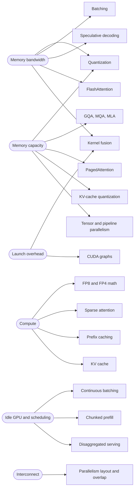
<!-- diagram:end -->
